# A2UI Renderer - Detailed Flow Diagram

## Overview
This document provides an in-depth view of how the A2UI Lit Renderer processes messages, manages state, renders components, and handles user interactions.

---

## 1. Message Processing Pipeline

```mermaid
flowchart TD
    Start([A2UI Messages Array]) --> Receive[Receive ServerToClientMessage[]]
    
    Receive --> Processor[A2uiMessageProcessor]
    
    Processor --> Loop{For each message}
    
    Loop --> CheckType{Message Type?}
    
    CheckType -->|beginRendering| BeginRender[handleBeginRendering]
    CheckType -->|surfaceUpdate| SurfaceUpdate[handleSurfaceUpdate]
    CheckType -->|dataModelUpdate| DataUpdate[handleDataModelUpdate]
    CheckType -->|deleteSurface| DeleteSurf[handleDeleteSurface]
    
    BeginRender --> CreateSurface[Create/Get Surface]
    CreateSurface --> SetRoot[Set rootComponentId]
    SetRoot --> ApplyStyles[Apply styles theme, font, primaryColor]
    ApplyStyles --> InitDataModel[Initialize DataModel Map]
    
    SurfaceUpdate --> GetSurface1[Get/Create Surface]
    GetSurface1 --> ParseComps[Parse ComponentInstance[]]
    ParseComps --> LoopComps{For each component}
    LoopComps --> ResolveComp[Resolve Component Type]
    ResolveComp --> StoreComp[Store in components Map]
    StoreComp --> LoopComps
    
    DataUpdate --> GetSurface2[Get/Create Surface]
    GetSurface2 --> ParsePath[Parse path default: '/']
    ParsePath --> ParseContents[Parse contents ValueMap[]]
    ParseContents --> ConvertData[convertKeyValueArrayToMap]
    ConvertData --> UpdateModel[Update DataModel at path]
    UpdateModel --> TriggerReactivity[Trigger Signal Updates]
    
    DeleteSurf --> RemoveSurface[Remove from surfaces Map]
    
    ApplyStyles --> Signal1[Trigger Reactive Updates]
    StoreComp --> Signal2[Trigger Reactive Updates]
    TriggerReactivity --> Signal3[Components Re-render]
    RemoveSurface --> Signal4[Remove from DOM]
    
    Signal1 --> End([Processing Complete])
    Signal2 --> End
    Signal3 --> End
    Signal4 --> End
    
    style Processor fill:#e1f5ff,stroke:#0277bd,stroke-width:3px
    style BeginRender fill:#fff3e0,stroke:#ef6c00
    style SurfaceUpdate fill:#f3e5f5,stroke:#7b1fa2
    style DataUpdate fill:#e8f5e9,stroke:#388e3c
    style DeleteSurf fill:#ffebee,stroke:#c62828
    style TriggerReactivity fill:#fff9c4,stroke:#f57f17,stroke-width:2px
```

---

## 2. Data Model Management

```mermaid
flowchart TB
    subgraph DataModel["Data Model Structure"]
        Root[Root DataMap]
        Root --> L1A["/restaurants"]
        Root --> L1B["/booking"]
        Root --> L1C["/user"]
        
        L1A --> L2A["0: DataMap"]
        L1A --> L2B["1: DataMap"]
        L2A --> L3A["name: 'Shanghai Garden'"]
        L2A --> L3B["cuisine: 'Chinese'"]
        L2A --> L3C["rating: 4.5"]
        L2A --> L3D["imageUrl: 'http://...'"]
    end
    
    subgraph Operations["Data Operations"]
        Get[getData<br/>node, relativePath, surfaceId]
        Set[setData<br/>node, relativePath, value, surfaceId]
        Resolve[resolvePath<br/>path, dataContextPath]
        
        Get --> ResolvePath1[Resolve absolute path]
        ResolvePath1 --> GetByPath[getDataByPath]
        GetByPath --> ReturnValue[Return DataValue]
        
        Set --> ResolvePath2[Resolve absolute path]
        ResolvePath2 --> SetByPath[setDataByPath]
        SetByPath --> Convert{Value type?}
        Convert -->|ValueMap[]| ConvertMap[convertKeyValueArrayToMap]
        Convert -->|JSON String| ParseJSON[parseIfJsonString]
        Convert -->|Primitive| Direct[Store directly]
        ConvertMap --> UpdateMap[Update Map at path]
        ParseJSON --> UpdateMap
        Direct --> UpdateMap
        UpdateMap --> SignalUpdate[Trigger Signal]
    end
    
    subgraph Paths["Path Resolution"]
        PathType{Path Type?}
        PathType -->|"."| Context["Use node's dataContextPath"]
        PathType -->|"/absolute"| Absolute["Use as-is"]
        PathType -->|"relative"| Relative["Combine with dataContextPath"]
        
        Context --> FinalPath[Final Path]
        Absolute --> FinalPath
        Relative --> FinalPath
    end
    
    style Root fill:#e8f5e9,stroke:#388e3c,stroke-width:2px
    style Get fill:#bbdefb,stroke:#1976d2
    style Set fill:#ffccbc,stroke:#d84315
    style SignalUpdate fill:#fff9c4,stroke:#f57f17,stroke-width:2px
```

---

## 3. Component Rendering Flow


---

## 4. Data Binding System


---

## 5. Event Handling Flow

```mermaid
flowchart LR
    subgraph Browser["Browser Events"]
        UserClick[👤 User clicks button]
        UserChange[👤 User changes input]
        UserSubmit[👤 User submits form]
    end
    
    subgraph Component["A2UI Component"]
        EventListener[Event Listener<br/>@click, @input, @change]
        ActionDef["action: {<br/>  action: 'book_restaurant',<br/>  context: {<br/>    restaurantName: {pathString: 'name'},<br/>    address: {pathString: 'address'}<br/>  }<br/>}"]
    end
    
    subgraph Processing["Event Processing"]
        HandleEvent[handleAction method]
        HandleEvent --> ResolveContext[Resolve action.context]
        ResolveContext --> LoopContext{For each context field}
        LoopContext --> GetValue[getData path, surfaceId]
        GetValue --> BuildContext[Build context object]
        BuildContext --> CreateUserAction["Create UserAction: {<br/>  actionName: 'book_restaurant',<br/>  sourceComponentId: 'btn-123',<br/>  timestamp: '2026-01-18T...',<br/>  context: {<br/>    restaurantName: 'Shanghai Garden',<br/>    address: '123 Main St'<br/>  }<br/>}"]
    end
    
    subgraph Emission["Event Emission"]
        CreateUserAction --> CreateEvent[Create StateEvent]
        CreateEvent --> CustomEvent["new CustomEvent('a2uiaction', {<br/>  detail: userAction,<br/>  bubbles: true,<br/>  composed: true<br/>})"]
        CustomEvent --> Dispatch[dispatchEvent]
    end
    
    subgraph ClientApp["Client Application"]
        Dispatch --> AppListener[App event listener]
        AppListener --> WrapMessage["Wrap in ClientToServerMessage: {<br/>  userAction: {<br/>    name: 'book_restaurant',<br/>    surfaceId: '@default',<br/>    sourceComponentId: 'btn-123',<br/>    timestamp: '...',<br/>    context: {...}<br/>  }<br/>}"]
        WrapMessage --> SendToServer[Send to A2A Server]
    end
    
    UserClick --> EventListener
    UserChange --> EventListener
    UserSubmit --> EventListener
    
    EventListener --> HandleEvent
    SendToServer --> ServerAPI[POST /send]
    
    style HandleEvent fill:#bbdefb,stroke:#1976d2,stroke-width:2px
    style CreateUserAction fill:#c8e6c9,stroke:#388e3c,stroke-width:2px
    style CustomEvent fill:#fff9c4,stroke:#f57f17
    style WrapMessage fill:#ffccbc,stroke:#d84315
```



---

## 6. Component Lifecycle


---

## 7. Complete Rendering Architecture

```mermaid
flowchart TB
    subgraph Input["Input Layer"]
        Messages[ServerToClientMessage[]]
    end
    
    subgraph Processing["Processing Layer"]
        Proc[A2uiMessageProcessor]
        Proc --> Surfaces[Surfaces Map<br/>surfaceId → Surface]
        
        Surfaces --> Surface1[Surface]
        Surface1 --> Components1[components Map<br/>id → ComponentInstance]
        Surface1 --> DataModel1[dataModel Map<br/>path → value]
        Surface1 --> Styles1[styles Object]
        Surface1 --> RootId1[rootComponentId]
    end
    
    subgraph Rendering["Rendering Layer"]
        RootComp[a2ui-root Component]
        RootComp --> GetSurface[Get Surface]
        GetSurface --> RenderTree[renderComponentTree]
        
        RenderTree --> CreateEl{Component Type}
        CreateEl -->|Custom| CustomEl[Custom Element]
        CreateEl -->|Standard| StdEl[Standard Component]
        
        CustomEl --> Registry[Component Registry]
        StdEl --> Catalog[Standard Catalog]
        
        Registry --> Instance1[Component Instance]
        Catalog --> Instance2[Lit Template]
        
        Instance1 --> BindData1[Bind Data]
        Instance2 --> BindData2[Bind Data]
        
        BindData1 --> DataBinding[Data Binding Engine]
        BindData2 --> DataBinding
        
        DataBinding --> Resolve[Resolve Paths]
        Resolve --> GetFromModel[Get from DataModel]
        GetFromModel --> PropValue[Property Value]
    end
    
    subgraph Output["Output Layer"]
        PropValue --> LitRender[Lit Render]
        LitRender --> ShadowDOM[Shadow DOM]
        ShadowDOM --> BrowserDOM[Browser DOM]
    end
    
    subgraph Reactivity["Reactivity System"]
        Signals[@lit-labs/signals]
        Signals --> SignalWatcher[SignalWatcher Mixin]
        SignalWatcher --> AutoTrack[Auto-track signal reads]
        AutoTrack --> TriggerUpdate[Trigger updates on changes]
        TriggerUpdate --> Rerender[Re-render component]
    end
    
    subgraph Events["Event System"]
        UserEvent[User Interaction]
        UserEvent --> Handler[Event Handler]
        Handler --> BuildAction[Build UserAction]
        BuildAction --> EmitEvent[Emit a2uiaction]
        EmitEvent --> AppLayer[Application Layer]
        AppLayer --> ServerReq[Server Request]
    end
    
    Messages --> Proc
    DataModel1 -.->|Reactive| Signals
    Rerender -.-> RenderTree
    ServerReq -.->|New Messages| Messages
    
    style Proc fill:#e1f5ff,stroke:#0277bd,stroke-width:3px
    style DataModel1 fill:#e8f5e9,stroke:#388e3c,stroke-width:2px
    style Signals fill:#fff9c4,stroke:#f57f17,stroke-width:3px
    style BrowserDOM fill:#ffccbc,stroke:#d84315,stroke-width:2px
```

---

## 8. Data Transformation Pipeline


---

## 9. Security Model in Renderer

```mermaid
flowchart TD
    Start([A2UI Message Received]) --> Validate1{Valid JSON?}
    
    Validate1 -->|No| Reject1[Reject: Parse Error]
    Validate1 -->|Yes| Validate2{Matches Schema?}
    
    Validate2 -->|No| Reject2[Reject: Schema Violation]
    Validate2 -->|Yes| CheckComp{Component Type}
    
    CheckComp -->|Custom| CheckRegistry{In Registry?}
    CheckComp -->|Standard| CheckCatalog{In Catalog?}
    
    CheckRegistry -->|No| Reject3[Reject: Unknown Component]
    CheckRegistry -->|Yes| Approved1[✓ Render Custom Component]
    
    CheckCatalog -->|No| Reject4[Reject: Unknown Type]
    CheckCatalog -->|Yes| Approved2[✓ Render Standard Component]
    
    Approved1 --> CheckProps{Validate Properties}
    Approved2 --> CheckProps
    
    CheckProps -->|Invalid| Sanitize[Sanitize/Ignore]
    CheckProps -->|Valid| BindData[Bind Data]
    
    Sanitize --> BindData
    
    BindData --> CheckPaths{Valid Data Paths?}
    CheckPaths -->|No| DefaultVal[Use default/null]
    CheckPaths -->|Yes| GetData[Get from DataModel]
    
    DefaultVal --> Render[Render Component]
    GetData --> Render
    
    Render --> Isolate[Render in Shadow DOM]
    Isolate --> NoCode{Code Execution?}
    
    NoCode -->|No| Safe[✓ Safe Rendering]
    NoCode -->|Yes| Block[Block: No eval/Function]
    
    Safe --> DOM[Display in Browser]
    
    Reject1 --> Error[Show Error]
    Reject2 --> Error
    Reject3 --> Error
    Reject4 --> Error
    Block --> Error
    
    style Validate1 fill:#ffebee,stroke:#c62828,stroke-width:2px
    style Validate2 fill:#ffebee,stroke:#c62828,stroke-width:2px
    style CheckRegistry fill:#ffebee,stroke:#c62828,stroke-width:2px
    style CheckCatalog fill:#ffebee,stroke:#c62828,stroke-width:2px
    style Safe fill:#e8f5e9,stroke:#388e3c,stroke-width:3px
    style Isolate fill:#fff9c4,stroke:#f57f17
```



---

## Key Renderer Concepts

### 1. **Message Types**
- **beginRendering**: Initialize surface with root component and styles
- **surfaceUpdate**: Add/update components in the component tree
- **dataModelUpdate**: Update data at a specific path
- **deleteSurface**: Remove entire surface

### 2. **Surface Structure**
```typescript
Surface {
  surfaceId: string
  rootComponentId: string
  components: Map<id, ComponentInstance>  // Reactive SignalMap
  dataModel: Map<path, value>              // Reactive SignalMap
  styles: { font?, primaryColor? }
}
```

### 3. **Component Resolution**
1. Check component registry for custom components
2. Fall back to standard catalog (Text, Button, Card, etc.)
3. Create element and bind properties
4. Recursively render children

### 4. **Data Binding**
- **Literal values**: `{ literalString: "Hello" }`
- **Path binding**: `{ pathString: "/user/name" }`
- **Computed**: `{ computedString: "Hello {{name}}" }`
- **Relative paths**: Resolved against `dataContextPath`

### 5. **Reactivity**
- Uses `@lit-labs/signals` for reactive data
- `SignalWatcher` mixin auto-tracks signal reads
- Data model changes trigger automatic re-renders
- Efficient DOM updates via Lit's virtual DOM diffing

### 6. **Event Flow**
```
User Action → Event Listener → Resolve Context → 
Create UserAction → Emit StateEvent → App Handles → 
Send to Server → New Messages → Re-render
```

### 7. **Security Guarantees**
- ✅ **No Code Execution**: JSON data only, no eval/Function
- ✅ **Component Catalog**: Only approved components rendered
- ✅ **Schema Validation**: All messages validated
- ✅ **Shadow DOM Isolation**: Components isolated from global scope
- ✅ **Path Validation**: Data paths validated before access
- ✅ **Property Sanitization**: Unknown properties ignored

---

## Performance Optimizations

1. **Reactive Signals**: Only re-render affected components
2. **Virtual DOM Diffing**: Lit efficiently updates only changed nodes
3. **Lazy Component Creation**: Components created on-demand
4. **Path Caching**: Resolved paths cached
5. **Batch Updates**: Multiple data updates batched
6. **Shadow DOM**: Style and script isolation

---

**Generated for A2UI Lit Renderer v0.8**

