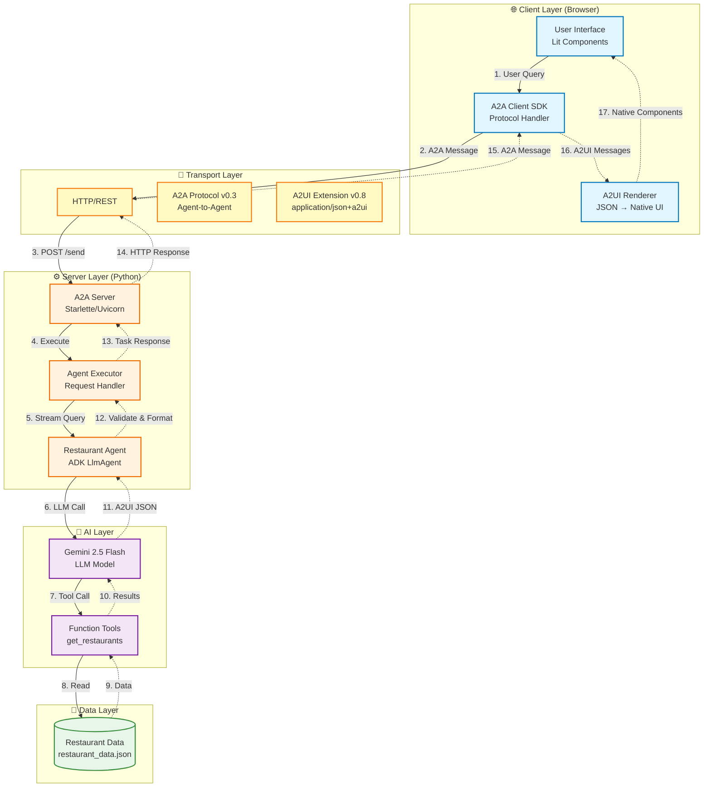
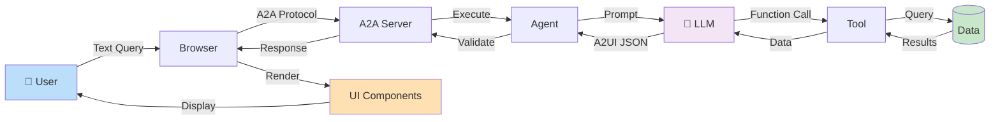
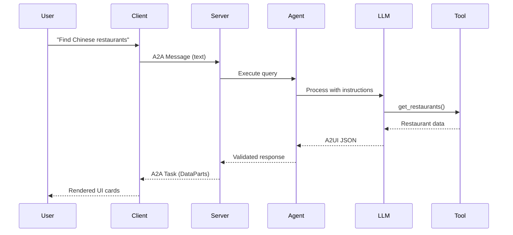
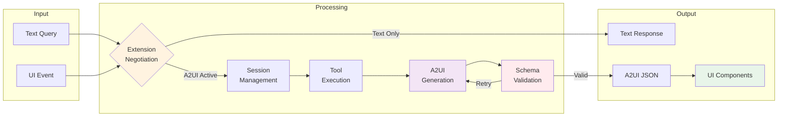
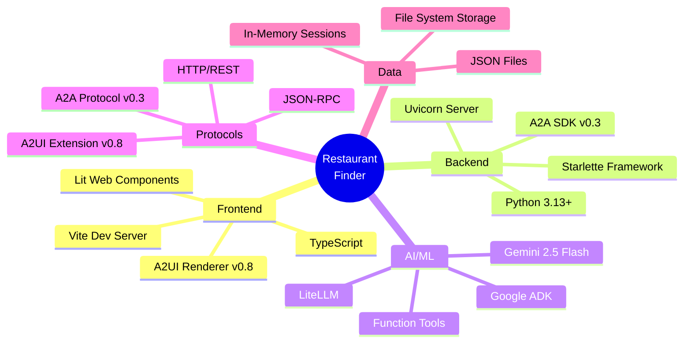
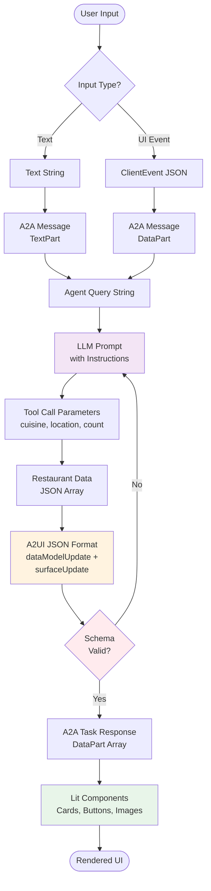
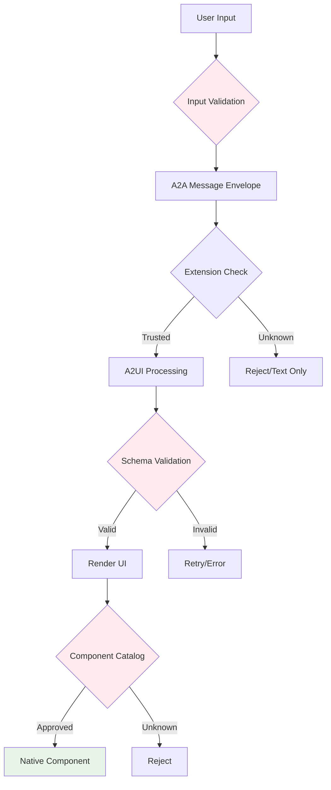

# Restaurant Finder - High Level Flow Diagram

## System Architecture Overview



## Simplified Data Flow



## Request/Response Flow



## Component Interaction Matrix



## Technology Stack



## Key Data Transformations



## Architecture Patterns

### 1. **Layered Architecture**
```
┌─────────────────────────────────┐
│   Presentation Layer (Lit UI)   │
├─────────────────────────────────┤
│   Protocol Layer (A2A/A2UI)     │
├─────────────────────────────────┤
│   Business Logic (Agent/LLM)    │
├─────────────────────────────────┤
│   Data Layer (JSON Files)       │
└─────────────────────────────────┘
```

### 2. **Request-Response Pattern**
```
Client → A2A Request → Server → Agent → LLM → Tool
   ↑                                              ↓
   └────── A2A Response ← Validate ← A2UI JSON ←─┘
```

### 3. **Event-Driven Pattern**
```
User Action → ClientEvent → DataPart → Agent Processing
                                              ↓
                                        New UI State
```

## Core Concepts

| Layer | Technology | Purpose |
|-------|-----------|---------|
| **Client** | Lit + TypeScript | Render UI components from A2UI JSON |
| **Transport** | A2A Protocol | Standardized agent communication |
| **Server** | Starlette + Python | Host agent and handle requests |
| **Agent** | Google ADK | Orchestrate LLM and tools |
| **AI** | Gemini LLM | Generate intelligent responses |
| **Format** | A2UI v0.8 | Declarative UI specification |

## Data Flow Summary

1. **Input**: User query (text) or UI event (JSON)
2. **Protocol**: Wrapped in A2A message format
3. **Processing**: Agent uses LLM + tools to process
4. **Generation**: LLM creates A2UI JSON response
5. **Validation**: Schema validation with retry logic
6. **Transport**: A2A protocol sends response
7. **Rendering**: Client renders native UI components
8. **Interaction**: User actions create new events → loop

## Security Model



**Key Security Features:**
- ✅ **Declarative Format**: A2UI is data, not code
- ✅ **Schema Validation**: All JSON validated against schema
- ✅ **Component Catalog**: Only pre-approved components rendered
- ✅ **Extension Negotiation**: Client controls what features to enable
- ✅ **Sandbox Execution**: No arbitrary code execution

---

**Generated for Restaurant Finder Application - A2UI Project**

