# Restaurant Finder Application - Sequence Diagram

## Overview
This sequence diagram illustrates the end-to-end flow of the Restaurant Finder application, showing how components interact from user input to UI rendering.

## Sequence Diagram

```mermaid
sequenceDiagram
    autonumber
    
    participant User as 🧑 User
    participant Browser as 🌐 Browser/Client
    participant A2UIClient as A2UI Client<br/>(Lit Component)
    participant ViteMiddleware as Vite Dev Server<br/>(A2A Middleware)
    participant A2AClient as A2A JS SDK<br/>Client
    participant A2AServer as A2A Server<br/>(Starlette)
    participant AgentExecutor as Restaurant<br/>Agent Executor
    participant Agent as Restaurant Agent<br/>(ADK LlmAgent)
    participant LLM as 🤖 Gemini LLM<br/>(gemini-2.5-flash)
    participant Tool as get_restaurants<br/>Tool
    participant FileSystem as 📁 File System<br/>(restaurant_data.json)
    participant A2UIRenderer as A2UI Renderer<br/>(Lit Components)
    
    %% Initial Request Flow
    rect rgb(200, 220, 255)
        Note over User,A2UIRenderer: Initial Query Flow
        User->>Browser: Enters query<br/>"Find top 5 Chinese restaurants in NY"
        Browser->>A2UIClient: User submits query
        A2UIClient->>ViteMiddleware: POST /a2a<br/>(text query)
        
        ViteMiddleware->>ViteMiddleware: Check if JSON or text
        Note over ViteMiddleware: Creates MessageSendParams<br/>with text part
        
        ViteMiddleware->>A2AClient: createOrGetClient()
        A2AClient->>A2AServer: GET /.well-known/agent-card.json<br/>(First time only)
        A2AServer-->>A2AClient: AgentCard with capabilities<br/>(A2UI extension, streaming)
        
        ViteMiddleware->>A2AClient: sendMessage(MessageSendParams)<br/>Headers: X-A2A-Extensions: a2ui/v0.8
        A2AClient->>A2AServer: POST /send<br/>(A2A Protocol Message)
    end
    
    %% Agent Processing Flow
    rect rgb(255, 240, 200)
        Note over A2AServer,LLM: Agent Processing Flow
        A2AServer->>AgentExecutor: execute(context, event_queue)
        
        AgentExecutor->>AgentExecutor: Check requested extensions
        Note over AgentExecutor: A2UI extension detected<br/>→ use UI agent
        
        AgentExecutor->>AgentExecutor: Extract query from message parts
        Note over AgentExecutor: Query: "Find top 5 Chinese<br/>restaurants in NY"
        
        AgentExecutor->>Agent: stream(query, session_id)
        
        Agent->>Agent: Create/Get session<br/>(InMemorySessionService)
        Agent->>Agent: Build LLM message with<br/>system instructions + UI prompt
        
        Note over Agent: Attempt 1/2<br/>(Validation & Retry Logic)
        
        Agent->>LLM: Run agent with instructions<br/>+ A2UI schema + examples
        Note over LLM: System Instruction:<br/>- Restaurant finding logic<br/>- A2UI JSON format<br/>- Tool usage guidelines
    end
    
    %% Tool Execution Flow
    rect rgb(220, 255, 220)
        Note over LLM,FileSystem: Tool Execution Flow
        LLM->>LLM: Parse user query<br/>Extract: cuisine=Chinese,<br/>location=NY, count=5
        
        LLM->>Tool: function_call: get_restaurants<br/>(cuisine="Chinese", location="NY", count=5)
        
        Tool->>Tool: Log tool call parameters
        Tool->>FileSystem: Read restaurant_data.json
        FileSystem-->>Tool: Restaurant data (JSON array)
        
        Tool->>Tool: Filter by location (New York)
        Tool->>Tool: Slice array to count (5 items)
        Tool->>Tool: Replace base_url from tool_context
        
        Tool-->>LLM: JSON string with 5 restaurants<br/>(name, cuisine, rating, address, image_url)
    end
    
    %% A2UI Generation Flow
    rect rgb(255, 220, 255)
        Note over LLM,Agent: A2UI Generation Flow
        LLM->>LLM: Use restaurant data + A2UI examples<br/>Generate A2UI JSON response
        
        Note over LLM: Response Format:<br/>Text---a2ui_JSON---<br/>[{dataModelUpdate: {...},<br/>surfaceUpdate: {...}}]
        
        LLM-->>Agent: Final response with A2UI JSON
        
        Agent->>Agent: Validate response
        Note over Agent: 1. Check delimiter '---a2ui_JSON---'<br/>2. Parse JSON<br/>3. Validate against A2UI schema
        
        alt Validation Success
            Agent->>Agent: Schema validation passes
            Agent-->>AgentExecutor: yield {is_task_complete: true,<br/>content: response}
        else Validation Failed (Attempt 1)
            Agent->>Agent: Schema validation fails
            Note over Agent: Prepare retry query with error details
            Agent->>LLM: Retry with validation error feedback
            LLM-->>Agent: Corrected response
            Agent->>Agent: Re-validate
            Agent-->>AgentExecutor: yield {is_task_complete: true,<br/>content: response}
        end
    end
    
    %% Response Processing Flow
    rect rgb(255, 255, 200)
        Note over AgentExecutor,A2AServer: Response Processing Flow
        AgentExecutor->>AgentExecutor: Split response at delimiter
        Note over AgentExecutor: text_content + json_string
        
        AgentExecutor->>AgentExecutor: Create Parts array
        Note over AgentExecutor: 1. TextPart (if text exists)<br/>2. DataParts (A2UI messages)
        
        AgentExecutor->>AgentExecutor: Parse JSON array
        loop For each A2UI message
            AgentExecutor->>AgentExecutor: create_a2ui_part(message)
            Note over AgentExecutor: Creates DataPart with<br/>mimeType: application/json+a2ui
        end
        
        AgentExecutor->>AgentExecutor: Set task state<br/>(TaskState.input_required)
        
        AgentExecutor->>A2AServer: Update task status<br/>new_agent_parts_message(final_parts)
        
        A2AServer-->>A2AClient: Task response with parts<br/>(TextPart + DataParts)
    end
    
    %% Client Rendering Flow
    rect rgb(220, 240, 255)
        Note over A2AClient,User: Client Rendering Flow
        A2AClient-->>ViteMiddleware: SendMessageSuccessResponse<br/>with Task result
        
        ViteMiddleware->>ViteMiddleware: Extract message parts<br/>from task.status.message.parts
        ViteMiddleware-->>A2UIClient: JSON response (DataParts array)
        
        A2UIClient->>A2UIClient: Filter data parts<br/>(extract A2UI messages)
        A2UIClient->>A2UIRenderer: Process A2UI messages
        
        A2UIRenderer->>A2UIRenderer: Parse dataModelUpdate<br/>(restaurant data, image URLs)
        A2UIRenderer->>A2UIRenderer: Parse surfaceUpdate<br/>(Card components, Buttons, Text)
        
        A2UIRenderer->>A2UIRenderer: Bind data model to UI components
        Note over A2UIRenderer: Create Lit components:<br/>- Cards (restaurant info)<br/>- Images<br/>- Buttons (Book Table)<br/>- Text fields
        
        A2UIRenderer->>Browser: Render components to DOM
        Browser->>User: Display restaurant cards with UI
    end
    
    %% User Interaction Flow (Booking)
    rect rgb(255, 220, 220)
        Note over User,A2UIRenderer: User Interaction Flow (Optional)
        User->>Browser: Clicks "Book Table" button
        Browser->>A2UIRenderer: UI event (click)
        
        A2UIRenderer->>A2UIClient: Emit A2UIClientEventMessage<br/>{userAction: {actionName: "book_restaurant",<br/>context: {restaurantName, address, imageUrl}}}
        
        A2UIClient->>ViteMiddleware: POST /a2a<br/>(JSON event data)
        
        ViteMiddleware->>ViteMiddleware: Detect JSON format
        Note over ViteMiddleware: Creates MessageSendParams<br/>with data part (A2UI event)
        
        ViteMiddleware->>A2AClient: sendMessage(event)
        A2AClient->>A2AServer: POST /send (UI event)
        
        A2AServer->>AgentExecutor: execute(context with DataPart)
        
        AgentExecutor->>AgentExecutor: Extract userAction from DataPart
        Note over AgentExecutor: action = "book_restaurant"<br/>Extract restaurant details
        
        AgentExecutor->>AgentExecutor: Build query:<br/>"USER_WANTS_TO_BOOK: {name},<br/>Address: {address}, ImageURL: {url}"
        
        AgentExecutor->>Agent: stream(booking_query, session_id)
        
        Agent->>LLM: Process booking request
        Note over LLM: Generate booking form UI<br/>using appropriate example
        
        LLM-->>Agent: Booking form A2UI JSON
        Agent-->>AgentExecutor: Validated response
        
        AgentExecutor->>AgentExecutor: Create DataParts for booking form
        AgentExecutor->>A2AServer: Update task with booking UI
        
        A2AServer-->>A2AClient: Task with booking form
        A2AClient-->>A2UIRenderer: Booking form A2UI messages
        
        A2UIRenderer->>Browser: Render booking form<br/>(date picker, party size, dietary reqs)
        Browser->>User: Display booking form
    end
    
    %% Session & State Management
    Note over Agent: Session Management:<br/>- InMemorySessionService<br/>- Session state persists base_url<br/>- Conversation history maintained
    
    Note over A2UIRenderer: A2UI Rendering:<br/>- Declarative JSON → Native Components<br/>- Data binding with signals<br/>- Event handling → ClientEventMessage<br/>- Security: No code execution
```



## Component Descriptions

### Frontend Components
- **Browser/Client**: User interface in the web browser
- **A2UI Client**: Lit web component managing UI state and events
- **Vite Dev Server Middleware**: Development server with A2A protocol middleware
- **A2A JS SDK Client**: JavaScript client for A2A protocol communication
- **A2UI Renderer**: Lit-based renderer that converts A2UI JSON to native web components

### Backend Components
- **A2A Server**: Starlette-based server implementing A2A protocol
- **Restaurant Agent Executor**: Handles agent execution lifecycle and request/response formatting
- **Restaurant Agent**: ADK LlmAgent with restaurant-finding logic and A2UI generation
- **Gemini LLM**: Google's Gemini 2.5 Flash model for natural language processing
- **get_restaurants Tool**: Function tool that retrieves restaurant data
- **File System**: Stores restaurant_data.json with sample data

## Key Flow Highlights

1. **Extension Negotiation**: Client sends `X-A2A-Extensions` header to request A2UI support
2. **Dual Mode**: Agent has both UI mode (with A2UI) and text mode (fallback)
3. **Tool Execution**: LLM decides when to call tools based on user query
4. **Validation & Retry**: Agent validates A2UI JSON against schema, retries if invalid
5. **Progressive Enhancement**: Response includes both text and structured UI data
6. **Event-Driven Interaction**: User actions (button clicks) generate A2UI ClientEvents
7. **Stateful Sessions**: Sessions maintain conversation context and state
8. **Security**: A2UI is declarative data, not executable code

## Data Flow Summary

```
User Query → Client → Middleware → A2A Server → Agent Executor → 
Restaurant Agent → Gemini LLM → Tool (get_restaurants) → File System →
LLM (A2UI Generation) → Agent (Validation) → Executor (Formatting) →
A2A Server → A2A Client → Middleware → A2UI Client → 
A2UI Renderer → Browser → User
```

## Technologies Used

- **Protocol**: A2A (Agent-to-Agent) v0.3.0
- **UI Format**: A2UI (Agent-to-User Interface) v0.8
- **Agent Framework**: Google ADK (Agent Development Kit)
- **LLM**: Gemini 2.5 Flash (via LiteLLM)
- **Backend**: Python, Starlette, Uvicorn
- **Frontend**: TypeScript, Lit, Vite
- **Client SDK**: @a2a-js/sdk

---

Generated for the Restaurant Finder sample application from the A2UI project.

