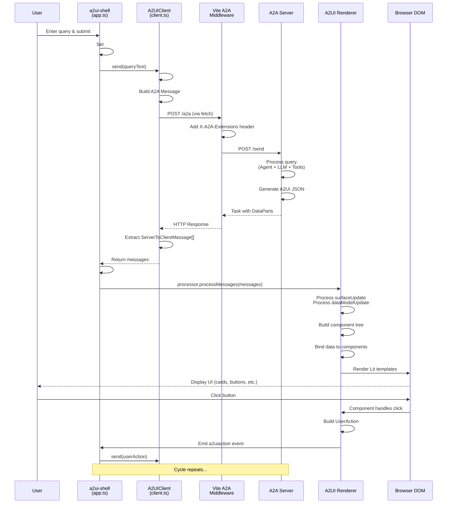

# A2UI Shell Client - Comprehensive Explanation

## Overview

The **A2UI Shell** (`@samples/client/lit/shell/`) is a **universal web-based client application** that serves as a demonstration and testing interface for A2UI-enabled agents. It's built with **Lit web components** and provides a complete UI for interacting with A2A agents that support the A2UI extension.

---

## Purpose & Use Cases

### Primary Purpose
A universal, reusable frontend application that can connect to any A2A agent supporting A2UI, allowing users to:
- Send text queries to agents
- Receive and render rich A2UI responses
- Interact with dynamic UI components
- Test agent implementations
- Demonstrate A2UI capabilities

### Key Features
- ✅ **Universal Client**: Works with any A2UI-compliant A2A agent
- ✅ **Multiple Configurations**: Pre-configured for different agents (restaurant, contacts)
- ✅ **Rich UI Rendering**: Renders A2UI components (cards, buttons, forms, etc.)
- ✅ **Interactive**: Handles user actions and sends them back to agents
- ✅ **Real-time Updates**: Shows loading states and processes streaming responses
- ✅ **Theme Support**: Light/dark mode with customizable theming
- ✅ **Responsive Design**: Mobile-friendly, adaptive layout

---

## Architecture

### Technology Stack

```
┌─────────────────────────────────────────┐
│           Browser (Chrome/Firefox)       │
├─────────────────────────────────────────┤
│  HTML (index.html) + CSS Variables       │
├─────────────────────────────────────────┤
│  Lit Web Components (app.ts)             │
│  - a2ui-shell (main component)           │
│  - Custom UI elements                    │
├─────────────────────────────────────────┤
│  A2UI Renderer (@a2ui/lit)               │
│  - Message processor                     │
│  - Component registry                    │
│  - Data binding engine                   │
├─────────────────────────────────────────┤
│  A2A Client SDK (@a2a-js/sdk)            │
│  - Protocol handler                      │
│  - Message serialization                 │
├─────────────────────────────────────────┤
│  A2A Middleware (Vite plugin)            │
│  - /a2a endpoint handler                 │
│  - Extension header injection            │
├─────────────────────────────────────────┤
│  HTTP/REST                               │
└─────────────────────────────────────────┘
         ↓
┌─────────────────────────────────────────┐
│  A2A Server (e.g., restaurant_finder)   │
└─────────────────────────────────────────┘
```

---

## Project Structure

```
samples/client/lit/shell/
│
├── 📄 index.html              # Entry point HTML with styles & fonts
├── 📄 app.ts                  # Main Lit component (a2ui-shell)
├── 📄 client.ts               # A2UIClient class (A2A communication)
├── 📄 vite.config.ts          # Vite dev server config with middleware
├── 📄 package.json            # Dependencies & scripts
│
├── 📁 configs/                # Agent-specific configurations
│   ├── types.ts              # AppConfig interface
│   ├── restaurant.ts         # Restaurant agent config
│   └── contacts.ts           # Contacts agent config
│
├── 📁 middleware/             # Vite middleware
│   └── a2a.ts                # A2A protocol middleware (proxy)
│
├── 📁 theme/                  # Theming configuration
│   └── default-theme.ts      # Default theme settings
│
├── 📁 ui/                     # Custom UI components
│   ├── snackbar.ts           # Toast notifications
│   └── ...                   # Other UI utilities
│
├── 📁 types/                  # TypeScript type definitions
│   └── types.ts              # App-specific types
│
├── 📁 events/                 # Event handling
│   └── events.ts             # Custom events
│
└── 📁 public/                 # Static assets
    └── hero.png              # Hero images
```

---

## Key Components

### 1. **index.html** - Application Shell

**Purpose**: Entry point for the application

**Key Features**:
- Material Icons font loading
- Google Fonts (Outfit) integration
- CSS custom properties for theming
- Color palette definitions (neutral, primary, secondary, tertiary, error)
- Grid system variables
- Responsive gradient background
- Light/dark mode support

**Structure**:
```html
<!DOCTYPE html>
<html>
  <head>
    <!-- Fonts & Icons -->
    <!-- CSS Variables & Theme -->
  </head>
  <body>
    <a2ui-shell></a2ui-shell>
    <script type="module" src="./app.ts"></script>
  </body>
</html>
```

---

### 2. **app.ts** - Main Application Component

**Class**: `A2UILayoutEditor` (custom element: `a2ui-shell`)

**Purpose**: Core UI logic and state management

**Key Responsibilities**:
1. **State Management**:
   ```typescript
   @state() #requesting = false;        // Loading state
   @state() #error: string | null;      // Error messages
   @state() #lastMessages: Message[];   // A2UI messages from agent
   @state() config: AppConfig;          // Current agent config
   ```

2. **UI Rendering**:
   - Hero image
   - Query input form
   - Submit button with loading animation
   - A2UI surface rendering
   - Snackbar notifications
   - Config switcher (restaurant/contacts)

3. **Message Handling**:
   ```typescript
   async #sendMessage(message: A2UIClientEventMessage) {
     // 1. Show loading state
     // 2. Send via A2UIClient
     // 3. Receive A2UI messages
     // 4. Update state → triggers re-render
   }
   ```

4. **Event Processing**:
   - Listens for `a2uiaction` events from rendered components
   - Converts user actions to ClientEventMessages
   - Sends back to agent for processing

**Rendering Pipeline**:
```
User Input → Form Submit → #sendMessage → A2UIClient.send → 
A2A Server → Response → #lastMessages updated → 
#processor.processMessages → Re-render → 
Display A2UI components
```

---

### 3. **client.ts** - A2A Communication Layer

**Class**: `A2UIClient`

**Purpose**: Handles all communication with A2A servers

**Key Methods**:

```typescript
class A2UIClient {
  #serverUrl: string;
  #client: A2AClient | null;

  constructor(serverUrl: string) {
    this.#serverUrl = serverUrl;
  }

  // Initialize A2A client with agent card
  async #getClient() {
    if (!this.#client) {
      this.#client = await A2AClient.fromCardUrl(
        `${baseUrl}/.well-known/agent-card.json`,
        {
          fetchImpl: (url, init) => {
            // Inject A2UI extension header
            headers.set("X-A2A-Extensions", 
              "https://a2ui.org/a2a-extension/a2ui/v0.8");
            return fetch(url, { ...init, headers });
          }
        }
      );
    }
    return this.#client;
  }

  // Send message to agent
  async send(message: A2UIClientEventMessage | string): 
    Promise<ServerToClientMessage[]> {
    const client = await this.#getClient();
    
    // Convert to A2A message format
    let parts: Part[] = [];
    if (typeof message === 'string') {
      parts = [{ kind: "text", text: message }];
    } else {
      parts = [{
        kind: "data",
        data: message,
        mimeType: "application/json+a2ui",
      }];
    }

    // Send via A2A protocol
    const response = await client.sendMessage({
      message: {
        messageId: crypto.randomUUID(),
        role: "user",
        parts: parts,
        kind: "message",
      },
    });

    // Extract A2UI messages from response
    if ("error" in response) {
      throw new Error(response.error.message);
    }

    const result = response.result as Task;
    const messages: ServerToClientMessage[] = [];
    for (const part of result.status.message?.parts) {
      if (part.kind === 'data') {
        messages.push(part.data as ServerToClientMessage);
      }
    }
    return messages;
  }
}
```

**Flow**:
```
1. First request → Fetch agent card from /.well-known/agent-card.json
2. Create A2AClient instance
3. For each message:
   - Wrap in A2A message format
   - Inject X-A2A-Extensions header
   - POST to /send endpoint
   - Extract DataParts from response
   - Return as ServerToClientMessage[]
```

---

### 4. **vite.config.ts** - Development Server Configuration

**Purpose**: Configure Vite dev server with A2A middleware

```typescript
export default async () => {
  return {
    plugins: [
      Middleware.A2AMiddleware.plugin()  // A2A proxy middleware
    ],
    build: {
      target: "esnext",
    },
    resolve: {
      dedupe: ["lit"],  // Prevent duplicate Lit instances
    },
  };
};
```

**Middleware Plugin** (`middleware/a2a.ts`):
- Intercepts requests to `/a2a`
- Proxies to actual A2A server
- Handles both text and JSON (A2UI events)
- Injects extension headers automatically

**Why Middleware?**:
- Avoids CORS issues during development
- Simplifies client code
- Centralizes extension header injection
- Provides single endpoint for all agent communication

---

### 5. **configs/** - Agent Configurations

Each agent has a configuration file defining:

```typescript
interface AppConfig {
  key: string;              // Unique identifier
  title: string;            // Display name
  heroImage: string;        // Light mode hero image
  heroImageDark: string;    // Dark mode hero image
  background: string;       // CSS background gradient
  placeholder: string;      // Input placeholder text
  loadingText: string[];    // Loading state messages
  serverUrl: string;        // A2A agent URL
}
```

**Example** (`configs/restaurant.ts`):
```typescript
export const config: AppConfig = {
  key: "restaurant",
  title: "Restaurant Finder",
  heroImage: "/hero.png",
  heroImageDark: "/hero-dark.png",
  background: `radial-gradient(...)`,
  placeholder: "Top 5 Chinese restaurants in New York.",
  loadingText: [
    "Finding the best spots for you...",
    "Checking reviews...",
    "Looking for open tables...",
    "Almost there...",
  ],
  serverUrl: "http://localhost:10002",
};
```

**Multi-Agent Support**:
```typescript
const configs: Record<string, AppConfig> = {
  restaurant: restaurantConfig,
  contacts: contactsConfig,
};
```

Switch between agents using the config selector in the UI.

---

## Data Flow

### Complete Request-Response Cycle



---

## User Interaction Flow

### 1. **Initial Query**

```
User types: "Find me top 5 Chinese restaurants in NY"
     ↓
Form submit event
     ↓
app.ts: #handleInput()
     ↓
app.ts: #sendMessage(queryText)
     ↓
client.ts: send(queryText)
     ↓
Converts to A2A Message:
{
  message: {
    messageId: "uuid",
    role: "user",
    parts: [{ kind: "text", text: "Find me..." }],
    kind: "message"
  }
}
     ↓
POST to /a2a (middleware)
     ↓
Middleware → A2A Server
     ↓
Agent processes → Returns A2UI JSON
     ↓
Response arrives back at client
     ↓
Extract ServerToClientMessage[] from DataParts
     ↓
app.ts: #lastMessages updated
     ↓
State change triggers re-render
     ↓
Renderer processes messages
     ↓
UI displays restaurant cards
```

### 2. **User Action (Button Click)**

```
User clicks "Book Table" button
     ↓
Button component (from A2UI renderer)
     ↓
Component has action definition:
{
  action: "book_restaurant",
  context: {
    restaurantName: { pathString: "name" },
    address: { pathString: "address" }
  }
}
     ↓
Renderer resolves context from data model:
{
  restaurantName: "Shanghai Garden",
  address: "123 Main St"
}
     ↓
Creates UserAction:
{
  actionName: "book_restaurant",
  sourceComponentId: "btn-123",
  timestamp: "2026-01-19T...",
  context: { restaurantName: "Shanghai Garden", ... }
}
     ↓
Emits custom event: a2uiaction
     ↓
app.ts: Listens for a2uiaction
     ↓
app.ts: #sendMessage(userAction)
     ↓
client.ts: send(userAction as DataPart)
     ↓
Converts to A2A Message:
{
  message: {
    parts: [{
      kind: "data",
      data: { userAction: {...} },
      mimeType: "application/json+a2ui"
    }]
  }
}
     ↓
POST to /a2a
     ↓
Agent processes booking request
     ↓
Returns new A2UI (booking form)
     ↓
UI updates with booking form
```

---

## Key Technologies & Dependencies

### Production Dependencies

| Package | Version | Purpose |
|---------|---------|---------|
| `@a2a-js/sdk` | ^0.3.4 | A2A protocol client SDK |
| `@a2ui/lit` | file:../../../../renderers/lit | A2UI Lit renderer |
| `lit` | ^3.3.1 | Web components framework |
| `@lit-labs/signals` | ^0.1.3 | Reactive state management |
| `@lit/context` | ^1.1.4 | Context API for dependency injection |

### Development Dependencies

| Package | Version | Purpose |
|---------|---------|---------|
| `vite` | ^7.1.11 | Dev server & build tool |
| `typescript` | ^5.8.3 | Type safety |
| `wireit` | ^0.15.0-pre.2 | Build orchestration |
| `dotenv` | ^17.2.3 | Environment variables |
| `uuid` | ^13.0.0 | UUID generation |

---

## Running the Application

### Prerequisites
1. Node.js installed
2. Lit renderer built (`renderers/lit`)
3. A2A agent running (e.g., restaurant_finder on port 10002)

### Commands

```bash
# Install dependencies
npm install

# Development server (with hot reload)
npm run dev
# → Starts on http://localhost:5173

# Build for production
npm run build

# Run tests
npm run test
```

### Development Workflow

1. **Start Agent**:
   ```bash
   cd samples/agent/adk/restaurant_finder
   uv run .
   # → Running on http://localhost:10002
   ```

2. **Start Client**:
   ```bash
   cd samples/client/lit/shell
   npm run dev
   # → Running on http://localhost:5173
   ```

3. **Access Application**:
   - Open browser: http://localhost:5173
   - Enter query
   - See A2UI rendering in real-time

---

## Features Deep Dive

### 1. **Theme System**

Uses **CSS custom properties** for theming:

```css
:root {
  /* Neutral colors */
  --n-100: #ffffff;  /* Lightest */
  --n-0: #000000;    /* Darkest */
  
  /* Primary colors */
  --p-40: #5154b3;   /* Primary shade */
  
  /* Semantic colors */
  --e-40: #ba1a1a;   /* Error */
  --s-40: #5d5c72;   /* Secondary */
}
```

**Light/Dark Mode**:
```css
background: light-dark(var(--n-100), var(--n-10));
```

Automatically switches based on:
- `prefers-color-scheme` media query
- Manual toggle (if implemented)

### 2. **Loading States**

**Animated Loading Text**:
```typescript
loadingText: [
  "Finding the best spots for you...",
  "Checking reviews...",
  "Looking for open tables...",
  "Almost there...",
]
```

Cycles through messages with interval:
```typescript
#startLoadingAnimation() {
  this.#loadingInterval = window.setInterval(() => {
    this.#loadingTextIndex = 
      (this.#loadingTextIndex + 1) % this.config.loadingText.length;
  }, 2000);
}
```

### 3. **Snackbar Notifications**

Toast-style notifications for:
- ✅ Success messages
- ❌ Error messages
- ℹ️ Info messages

```typescript
snackbar(message: string, type: SnackType) {
  // Shows temporary notification at bottom
}
```

### 4. **A2UI Message Processing**

Uses **A2uiMessageProcessor** from `@a2ui/lit`:

```typescript
#processor = new v0_8.Data.A2uiMessageProcessor();

// When messages arrive
this.#processor.processMessages(this.#lastMessages);

// Get surfaces for rendering
const surfaces = this.#processor.getSurfaces();
```

**Processor handles**:
- `beginRendering` - Initialize surface
- `surfaceUpdate` - Add/update components
- `dataModelUpdate` - Update data
- `deleteSurface` - Remove surface

---

## Security Considerations

### Input Validation
- All agent responses validated against A2UI schema
- Only approved components from catalog rendered
- No arbitrary code execution

### Extension Header
```typescript
headers.set("X-A2A-Extensions", 
  "https://a2ui.org/a2a-extension/a2ui/v0.8");
```

**Purpose**:
- Explicitly requests A2UI support
- Agent knows client can handle A2UI responses
- Versioned for compatibility

### Data Handling
- Treat all agent data as untrusted
- Validate before displaying
- Sanitize user inputs
- Use Shadow DOM for component isolation

---

## Customization & Extension

### Adding a New Agent Configuration

1. **Create config file** (`configs/myagent.ts`):
```typescript
export const config: AppConfig = {
  key: "myagent",
  title: "My Custom Agent",
  serverUrl: "http://localhost:10003",
  placeholder: "Ask me anything...",
  loadingText: ["Processing..."],
  // ... other properties
};
```

2. **Register in app.ts**:
```typescript
const configs: Record<string, AppConfig> = {
  restaurant: restaurantConfig,
  contacts: contactsConfig,
  myagent: myAgentConfig,  // Add here
};
```

3. **Access via URL or selector**:
   - Switch using config dropdown
   - URL parameter (if implemented)

### Custom Components

Register custom A2UI components:

```typescript
import { componentRegistry } from "@a2ui/lit";

// Register custom component
componentRegistry.set("my-custom-card", MyCustomCard);
```

Component will be used when agent sends:
```json
{
  "component": {
    "my-custom-card": {
      "properties": { ... }
    }
  }
}
```

---

## Best Practices

### 1. **State Management**
- Use `@state()` for reactive properties
- Keep state in single component when possible
- Use signals for complex shared state

### 2. **Performance**
- Lit efficiently updates only changed parts
- Use `@property()` sparingly
- Leverage Shadow DOM for encapsulation

### 3. **Error Handling**
```typescript
try {
  const response = await this.#a2uiClient.send(message);
  this.#lastMessages = response;
} catch (err) {
  this.snackbar(err as string, SnackType.ERROR);
  this.#error = err as string;
}
```

### 4. **Type Safety**
- Use TypeScript interfaces
- Validate A2UI message types
- Type all event handlers

---

## Troubleshooting

### Common Issues

| Issue | Solution |
|-------|----------|
| **CORS errors** | Ensure middleware is running |
| **Agent not responding** | Check agent is running on correct port |
| **UI not rendering** | Verify A2UI messages match schema |
| **Events not firing** | Check event listener setup |
| **Styles not loading** | Rebuild renderer: `npm run build` |

### Debug Mode

Check browser console for:
- A2A messages
- A2UI validation errors
- Component rendering logs

```typescript
console.log('[a2ui-shell] Received messages:', messages);
console.log('[a2ui-shell] Surfaces:', processor.getSurfaces());
```

---

## Summary

The **A2UI Shell** is a **production-ready, universal client** for A2UI agents that demonstrates:

✅ **Complete A2A/A2UI integration**  
✅ **Real-world UI/UX patterns**  
✅ **Multi-agent support**  
✅ **Extensible architecture**  
✅ **Modern web technologies**  
✅ **Security best practices**

It serves as both a **functional tool** and a **reference implementation** for building A2UI-enabled applications.

---

**Generated for A2UI Shell Client v0.8.1**

